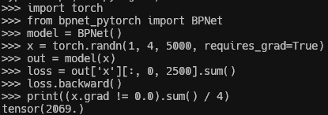

# bpnet-pytorch (wip)


Implementation of BPNet, a base-resolution deep neural network for functional genomics tasks. The offical implementation of BPNet can be found [here](https://github.com/kundajelab/bpnet).

## Installation

```shell
$ pip install bpnet-pytorch
```

## Usage
```Python
from bpnet_pytorch import BPNet

model = BPNet()

x = torch.randn(1, 4, 1000)
out = model(x)
# out['x'] contains the output of the convolution layers.
# May not be useful, but left for debugging purpose for now.
### shape: (1, 64, 1000)

# out['profile'] contains the output of profile head.
### shape: (1, 1000, 2), 2 for +/- strands.

# out['total_count'] contains the output of total count head.
### shape: (1, 2), 2 for +/- strands.
```

## Training

### Data
Training data used to train the original BPNet model can be found [here](https://zenodo.org/record/3371216) (30.8GB).

## TODO

- [x] Confirm that the receptive field is +-1034bp.



- [x] Implement early stopping.

- [x] Implement multinomial negative log-likelihood loss.

- [ ] Modify heads for multi-task (multi-TF) prediction.

- [ ] Prepare training data.

- [ ] Train the model and reproduce the performance.

## Citation
```bibtex
@article{avsec2021base,
  title={Base-resolution models of transcription-factor binding reveal soft motif syntax},
  author={Avsec, {\v{Z}}iga and Weilert, Melanie and Shrikumar, 
    Avanti and Krueger, Sabrina and Alexandari, Amr and Dalal, Khyati and Fropf,
    Robin and McAnany, Charles and Gagneur, Julien and Kundaje, Anshul and others},
  journal={Nature Genetics},
  volume={53},
  number={3},
  pages={354--366},
  year={2021},
  publisher={Nature Publishing Group US New York}
}
```
