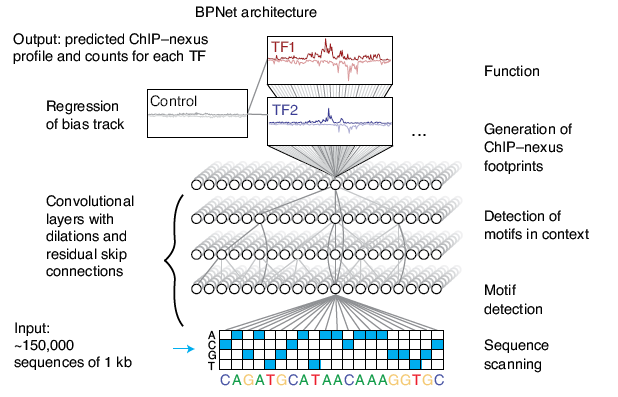

# bpnet-pytorch (wip)



Implementation of BPNet, a base-resolution deep neural network for functional genomics tasks. The offical implementation of BPNet can be found [here](https://github.com/kundajelab/bpnet).

## Installation

```shell
$ pip install bpnet-pytorch
```

## TODO

- [ ] Figure out why the receptive field is +-1034bp.

- [ ] Prepare training data.

- [ ] Train the model and reproduce the performance.